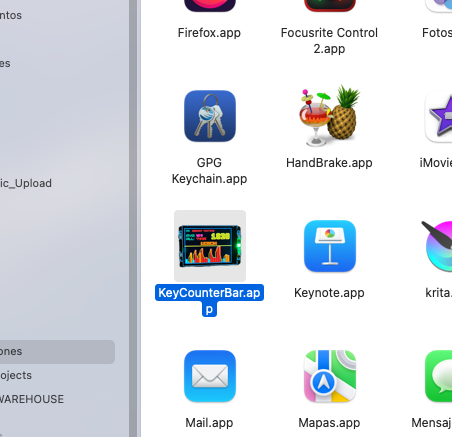
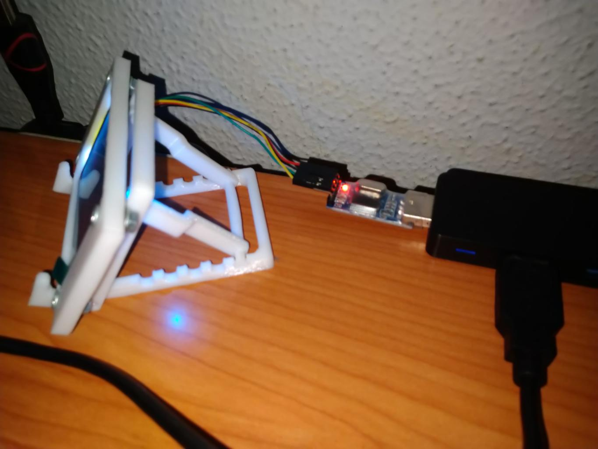

# Python KeyCounter (Contador de Pulsaciones para Linux y MacOS)

Herramienta en python 3 para contar la cantidad de teclas que se ha pulsado en 
un tiempo determinado o sesión.

## Objetivos

Los objetivos de estos scripts es contar las pulsaciones de teclas, mostrarlo
por una pantalla y en la barra de navegación teniendo la posibilidad de
subirlos a una API desde un caché temporal en una db sqlite que se crea bajo
el mismo directorio del script.

<p align="center">
  
  
  
  
</p>

### Visualización de datos en pantalla serial UART

Existe la posibilidad de enviar datos a una pantalla (o dispositivo) por
serial al realizar pulsaciones.

En este momento solo he planteado la aplicación para utilizar la única pantalla
que encontré por internet asequible por pocos euros.

Si pretendes utilizar otra pantalla distinta sería necesario adaptar la clase
LCDUart.py manteniendo el mismo nombre para los métodos actuales.

También puedes crear un modelo para tu propia pantalla y añadir una nueva
variable de entorno al **.env** para posteriormente controlar su carga con
una condición if.

### Unix Socket Server (Socket Unix)

Se crea un servidor socket unix en **/var/run/keycounter.socket** al que se le
pueden hacer peticiones para obtener las estadísticas de pulsaciones.

En el archivo para debug ** ./Debug/client_socket.py** se puede encontrar un
ejemplo del modo para conectar desde otras aplicaciones obteniendo los datos
del momento en el que se hayan pedido.

Se crea un socket UNIX que permite acceder a los datos desde otras
aplicaciones y desde el propio sistema operativo a través de un socket que
será creado en la ruta: **/var/run/keycounter.socket**

Es posible modificar el comportamiento o ruta del socket desde el modelo Socket.py

En el directorio de debug tienes algún ejemplo/prueba de como fuí depurando
para lograr afinar esta parte.

Yo personalmente utilizo esto para mostrar la cantidad de pulsación en mi barra
de navegación **i3pystatus** para el entorno gráfico o más bien gestores de
ventanas como **i3wm** o **sway** que son los que suelo utilizar.

Puedes comprobar la información del socket si funciona correctamente usando
el siguiente comando:

```bash
nc -U /var/run/keycounter.socket
```


### Base de datos SQLite para Caché

Los registros serán almacenados temporalmente en un base de datos local
situada en el mismo directorio del script llamada **keycounter.db** que se
gestiona desde el modelo **DbConnection.py** representando la conexión con
dicha base de datos.

Para la base de datos se utiliza el ORM **SQLAlchemy**

## Instalando (En Debian)

Esta herramienta solo la he llegado a probar en Debian GNU/Linux, también
de forma parcial en fedora.

### Dependencias

A continuación señalo las depenedencias que he necesitado para lograr
ejecutar con éxito esta herramienta.

Puede ser que necesite alguna más y no me haya dado cuenta de ello al tenerla
previamente instalada de alguna otra aplicación en mi sistema.

#### Con el gestor de paquetes de python, pip

Dependencias que instalo desde el gestor de paquetes **pip** para python:

```bash
pip3 install keyboard mouse
```

_Hay que tener en cuenta que para que funcione el keycounter es necesario
ejecutarlo como root, por lo tanto el comando anterior tal vez sea necesario
hacerlo con tal usuario de la siguiente forma_

```bash
sudo pip3 install keyboard mouse
```

En caso de no estar en debian o no tenerlo en repositorios, deberá instalarse
desde pip todas las dependencias así:

```bash
sudo pip3 install keyboard mouse serial sqlalchemy python-dotenv requests
```

De cualquier modo, adapta el comando a tu entorno.

#### Desde el gestor de paquetes y repositorios oficiales para Debian stable

Si estamos en debian, es mejor instalar las dependencias que existan en
repositorios.

A continuación la línea que he utilizado para obtener las dependencias de
python que existen en los repositorios en lugar de hacerlo desde el gestor
de paquetes de python 3:

```bash
sudo apt install python3-serial python3-dotenv python3-sqlalchemy python3-requests
```

## Ejecución

Se necesitan configurar las variables de nuestro entorno copiando el archivo
.env.example a .env y modificando en este nuestros parámetros de configuración
que se encuentran en su interior descritos.

## Aplicación para MacOS

En el directorio "macos" he dejado también el código fuente de una pequeña
aplicación para conectar al socket unix que podemos crear y sacar la 
información de las rachas en la sesión.

Esta información la podemos usar con cualquier programa, en este caso se 
coloca en la barra superior del sistema para mantenerla visible en todo momento.

Algunas imágenes del keycounter para macos:

<p align="center">
  
  
  
  
</p>

Puedes arrastrarla (adjunto el **app** en el directorio **macos** y el código 
fuente si la quieres compilar por tu cuenta) al directorio de aplicaciones y 
posteriormente añadirla a las aplicaciones ejecutadas al inicio del sistema para 
que cargue automáticamente tras un reinicio.

## Ejecutar automáticamente al iniciar el sistema

Posteriormente ejecutar **main.py** como root. Puede añadirse a un cron @reboot
para que sea ejecutado en el inicio del sistema y esté siempre funcionando en
el background.

## Renombrar pantalla UART

Es posible que tengas problemas con la configuración para la pantalla si
estás continuamente suspendiendo (en mi caso es así) o desconectando la pantalla
cada poco tiempo.

En estos casos suele producirse un pequeño conflicto, se renombra la interfaz
por lo que cuando conectamos ya no funcionará mostrando datos correctamente.

Esto no es un gran problema ya que podemos crear una regla en nuestro sistema
operativo para que quede de forma estática enlazando al punto de montaje de
turno con dicha interfaz. De este modo pondremos en la configuración de esta
herramienta el dispositivo que hemos renombrado o enlazado.

<p align="center">
  
  
  
  
</p>

A continuación explico como realizarlo en **GNU/Linux (Debian)**.

### Listar dispositivo conectado

```bash
sudo dmesg | grep ttyUSB
```

### Listar atributos

```bash
udevadm info --name=/dev/ttyUSB0 --attribute-walk
```

### Añadir regla udev

Abrimos el archivo y añadimos la regla modificando el "serial", el "idVendor" y el "idProduct"

```bash
sudo nano /etc/udev/rules.d/10-usb-serial.rules
```

SUBSYSTEM=="tty", ATTRS{idVendor}=="05e3", ATTRS{idProduct}=="0610", ATTRS{serial}=="0000:00:14.0", SYMLINK+="ttyUSB_KEYCOUNTER"

### Recargar nueva configuración

```bash
sudo udevadm trigger
```
